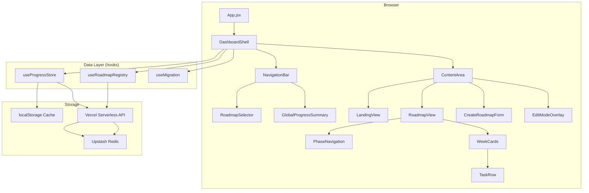

# Design Document: Roadmap Dashboard

## Overview

The Roadmap Dashboard transforms the existing single-roadmap React application into a multi-roadmap dashboard with persistent backend storage. The current `Roadmap.jsx` component renders a single hardcoded roadmap with localStorage-based progress tracking. The new architecture introduces a dashboard shell, a roadmap registry, a pluggable progress store with localStorage caching and backend sync, and editing capabilities — all while preserving the existing dark, minimal visual language.

**Key Design Decisions:**
- **Vercel Serverless Functions + Upstash Redis** for backend storage: HTTP-based Redis is ideal for key-value progress data, has a generous free tier, works natively with Vercel's serverless architecture, and requires no connection pooling.
- **localStorage as a write-through cache**: Provides instant reads and offline resilience while syncing to backend asynchronously.
- **Data-driven rendering**: Roadmaps are defined as JSON data conforming to a schema — no code changes needed to add new roadmaps.
- **Existing component preservation**: The rendering logic from `Roadmap.jsx` is extracted into a generic `RoadmapView` component that accepts any conforming data structure.

## Architecture



### Data Flow

1. **On load**: `useMigration` checks for legacy `nick-roadmap-v1` localStorage key and migrates if needed. `useRoadmapRegistry` fetches the list of roadmaps. `useProgressStore` loads progress from localStorage immediately, then fetches from backend — using timestamp-based conflict resolution.
2. **On task toggle**: Progress updates localStorage synchronously, then enqueues a backend sync (debounced, within 2 seconds).
3. **On roadmap switch**: Progress for the new roadmap loads from localStorage cache (instant), backend fetch validates/updates if stale.
4. **On roadmap create/edit**: Changes persist to backend via API, with optimistic local updates.

## Components and Interfaces

### DashboardShell

The top-level container managing routing state (which roadmap is active), global layout, and coordination between child components.

```jsx
// Props: none (root component)
// State: activeRoadmapId (string | null), viewMode ('landing' | 'view' | 'create' | 'edit')
```

### NavigationBar

Fixed top bar containing the app title, `RoadmapSelector` dropdown, and `GlobalProgressSummary`.

### RoadmapSelector

Dropdown/list component showing all available roadmaps with their titles and completion percentages.

```typescript
interface RoadmapSelectorProps {
  roadmaps: RoadmapMeta[];
  activeId: string | null;
  onSelect: (id: string) => void;
}

interface RoadmapMeta {
  id: string;
  title: string;
  subtitle: string;
  dateRange: { start: string; end: string };
  completedTasks: number;
  totalTasks: number;
}
```

### RoadmapView

Generic roadmap renderer extracted from the current `Roadmap.jsx`. Accepts any data conforming to the roadmap schema.

```typescript
interface RoadmapViewProps {
  roadmap: RoadmapData;
  progress: Record<string, boolean>;
  onToggleTask: (taskId: string) => void;
  editMode?: boolean;
  onEditAction?: (action: EditAction) => void;
}
```

### CreateRoadmapForm

Form component for creating new roadmaps with validation.

### EditModeOverlay

Overlay controls for structural editing (add/remove/reorder phases, weeks, tasks).

### Custom Hooks

```typescript
// useRoadmapRegistry: manages the list of all roadmaps and their definitions
function useRoadmapRegistry(): {
  roadmaps: RoadmapData[];
  meta: RoadmapMeta[];
  addRoadmap: (data: RoadmapData) => Promise<void>;
  updateRoadmap: (id: string, data: Partial<RoadmapData>) => Promise<void>;
  loading: boolean;
  error: string | null;
}

// useProgressStore: manages per-roadmap completion state with localStorage cache + backend sync
function useProgressStore(roadmapId: string | null): {
  progress: Record<string, boolean>;
  toggle: (taskId: string) => void;
  loading: boolean;
  syncing: boolean;
  error: string | null;
  isOffline: boolean;
}

// useMigration: handles one-time legacy data import
function useMigration(): {
  migrated: boolean;
  migrating: boolean;
}
```

## Data Models

### Roadmap Schema

```typescript
interface RoadmapData {
  id: string;              // unique, 1-100 chars, URL-safe (e.g., "nick-2yr-engineering")
  title: string;           // 1-100 characters
  subtitle: string;        // 0-200 characters
  dateRange: {
    start: string;         // ISO 8601 date string
    end: string;           // ISO 8601, >= start
  };
  accentColors: string[];  // 1-10 hex color strings (e.g., ["#0F6E56", "#185FA5"])
  categories: Record<string, CategoryDef>;
  phases: Phase[];
  createdAt: string;       // ISO 8601 datetime
  updatedAt: string;       // ISO 8601 datetime
}

interface CategoryDef {
  label: string;           // display label
  bg: string;              // background color (hex or CSS var reference)
  color: string;           // text color (hex or CSS var reference)
}

interface Phase {
  id: string;              // unique within roadmap
  title: string;
  subtitle: string;
  dateRange: string;       // display string (e.g., "Jun 15 – Aug 2026")
  milestones: string[];    // 0-20 entries
  weeks: Week[];
}

interface Week {
  id: string;              // unique within phase
  label: string;
  dates: string;
  tasks: Task[];           // 1-20 tasks
}

interface Task {
  id: string;              // globally unique across all roadmaps
  cat: string;             // category key referencing categories object
  text: string;            // 1-500 characters
}
```

### Progress Record

```typescript
interface ProgressRecord {
  roadmapId: string;
  tasks: Record<string, boolean>;  // taskId -> completed
  updatedAt: string;               // ISO 8601 datetime, for conflict resolution
}
```

### Backend Storage Schema (Upstash Redis)

```
Key pattern:
  roadmap:registry              → JSON array of RoadmapData objects
  roadmap:{id}:definition       → JSON RoadmapData object
  progress:{roadmapId}          → JSON ProgressRecord object

All values stored as JSON strings. Upstash Redis provides atomic GET/SET
with TTL support if needed for cache invalidation.
```

### Vercel Serverless API Routes

```
/api/roadmaps
  GET  → returns all roadmap definitions
  POST → creates a new roadmap

/api/roadmaps/[id]
  GET  → returns single roadmap definition
  PUT  → updates roadmap definition

/api/progress/[roadmapId]
  GET  → returns progress record
  PUT  → updates progress record (includes updatedAt for conflict resolution)
```

## Correctness Properties

*A property is a characteristic or behavior that should hold true across all valid executions of a system — essentially, a formal statement about what the system should do. Properties serve as the bridge between human-readable specifications and machine-verifiable correctness guarantees.*

### Property 1: Progress Calculation Correctness

*For any* set of roadmaps with arbitrary task counts and any completion state map, the computed progress percentage SHALL equal `Math.round((completedTasks / totalTasks) * 100)` and the count SHALL equal the number of `true` entries in the completion map that correspond to valid task IDs in the given roadmap(s).

**Validates: Requirements 1.2, 2.1**

### Property 2: Valid Roadmap Data Renders Without Error

*For any* roadmap data structure conforming to the schema (valid ID, title, phases with weeks containing 1-20 tasks each with valid category keys), the `RoadmapView` component SHALL render without throwing an error and SHALL produce output containing all task texts and category labels.

**Validates: Requirements 3.1, 3.2, 3.3, 3.4, 3.5**

### Property 3: Unknown Category Key Fallback

*For any* task whose `cat` field references a key not present in the roadmap's `categories` object, the rendered task SHALL use `--color-text-secondary` for text color and `--color-background-secondary` for background color.

**Validates: Requirements 3.7**

### Property 4: Completion State Isolation Between Roadmaps

*For any* two distinct roadmaps and any sequence of task toggles applied to one roadmap, the completion state of the other roadmap SHALL remain unchanged.

**Validates: Requirements 4.1, 2.4**

### Property 5: Composite Key Determinism

*For any* roadmap ID and task ID pair, the storage key produced by the Progress_Store SHALL be a deterministic function of those two inputs, and two different (roadmapId, taskId) pairs SHALL never produce the same storage key.

**Validates: Requirements 4.2**

### Property 6: Conflict Resolution — Most Recent Timestamp Wins

*For any* two progress records for the same roadmap with different `updatedAt` timestamps and differing task states, the resolved state SHALL equal the record with the more recent timestamp.

**Validates: Requirements 5.5**

### Property 7: Form Validation Completeness

*For any* roadmap creation input where the title is a non-empty string of 1-100 characters, dates form a valid range (end >= start), and 1-20 categories each have labels of 1-30 characters, the form SHALL accept the input. *For any* input violating any of these constraints, the form SHALL reject it and display appropriate inline error messages.

**Validates: Requirements 6.2, 6.4**

### Property 8: Edit Operations Preserve Structural Integrity

*For any* valid roadmap structure and any sequence of add/remove/reorder operations on phases, weeks, or tasks, the resulting structure SHALL still conform to the roadmap schema (all IDs unique, weeks contain 1-20 tasks, phases contain weeks, no orphaned references).

**Validates: Requirements 7.2, 7.3, 7.4**

### Property 9: Discard Reverts to Persisted State

*For any* persisted roadmap state and any set of unsaved edits, invoking "discard" SHALL produce a state exactly equal to the last persisted state.

**Validates: Requirements 7.6**

### Property 10: Legacy Migration Correctness

*For any* valid legacy completion map (object mapping task IDs to booleans), migration SHALL produce a progress record where every task ID that exists in both the legacy map and the target roadmap retains its boolean value, and task IDs present only in the legacy map are ignored.

**Validates: Requirements 8.2, 8.3**

### Property 11: Migration Idempotence

*For any* legacy completion map, running the migration function N times (N >= 1) SHALL produce the same progress record as running it exactly once.

**Validates: Requirements 8.4**

### Property 12: Accent Color by Phase Index

*For any* roadmap with an accent color array of length K and an active phase at index I (where 0 <= I < K), the rendered phase indicator SHALL use `accentColors[I]` as its accent color.

**Validates: Requirements 9.4**

### Property 13: Category Tag Color Mapping

*For any* task with a category key that exists in the roadmap's categories object, the rendered category tag SHALL use the `bg` property for its background and the `color` property for its text color from that category definition.

**Validates: Requirements 9.5**

## Error Handling

| Scenario | Behavior |
|----------|----------|
| Backend unreachable on load | Load from localStorage, show "offline" indicator (non-blocking) |
| Backend timeout (>5s) | Fall back to localStorage cache, show cached-data indicator |
| Backend write failure | Retain change in localStorage, queue for retry on next connection |
| localStorage write failure | Show non-blocking error notification (auto-dismiss 5s), retain in memory |
| Invalid roadmap data in registry | Skip malformed entry, log warning, render remaining roadmaps |
| Unknown category key on task | Render with default styling (--color-text-secondary / --color-background-secondary) |
| Conflict between localStorage and backend | Most recent `updatedAt` timestamp wins, stale copy overwritten |
| Form validation failure | Inline error messages per field, form does not submit |
| Roadmap save failure (create/edit) | Non-blocking error notification, retain user input in form/editor |
| Legacy migration with unmatched IDs | Skip unmatched entries silently, proceed with valid matches |

### Retry Strategy

Backend sync uses exponential backoff:
- Initial delay: 2 seconds
- Max retries: 5
- Backoff factor: 2x (2s, 4s, 8s, 16s, 32s)
- After max retries: remain in localStorage-only mode, retry on next user action

## Testing Strategy

### Property-Based Tests (fast-check)

The project will use [fast-check](https://github.com/dubzzz/fast-check) for property-based testing with Vitest as the test runner.

**Configuration:**
- Minimum 100 iterations per property test
- Each test tagged with: `Feature: roadmap-dashboard, Property {N}: {title}`

**Properties to implement:**
1. Progress calculation (pure function — easy to PBT)
2. Valid schema renders (component render with arbitrary data)
3. Unknown category fallback (render edge case)
4. Completion isolation (state management logic)
5. Composite key determinism (pure function)
6. Conflict resolution (pure function)
7. Form validation (pure function validators)
8. Edit operations integrity (state transformation)
9. Discard reverts state (state management)
10. Legacy migration correctness (pure function)
11. Migration idempotence (pure function)
12. Accent color by index (render logic)
13. Category color mapping (render logic)

### Unit Tests (Vitest)

- Dashboard initial render (landing view, no selection)
- Roadmap selector active state styling
- Create form field validation edge cases
- Error notification display and auto-dismiss
- Edit mode toggle behavior
- Confirmation prompts on destructive actions

### Integration Tests

- Backend API routes (GET/POST/PUT for roadmaps and progress)
- localStorage ↔ backend sync flow
- Migration from legacy format on first load
- Offline → online sync recovery

### Test Libraries

- **Vitest**: Test runner (already compatible with Vite)
- **fast-check**: Property-based testing
- **@testing-library/react**: Component rendering and interaction
- **msw (Mock Service Worker)**: API mocking for integration tests


// Test